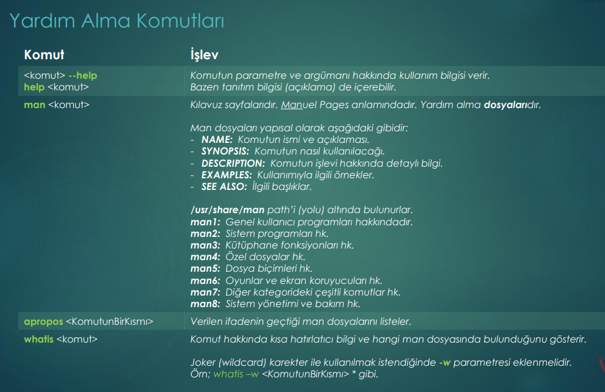
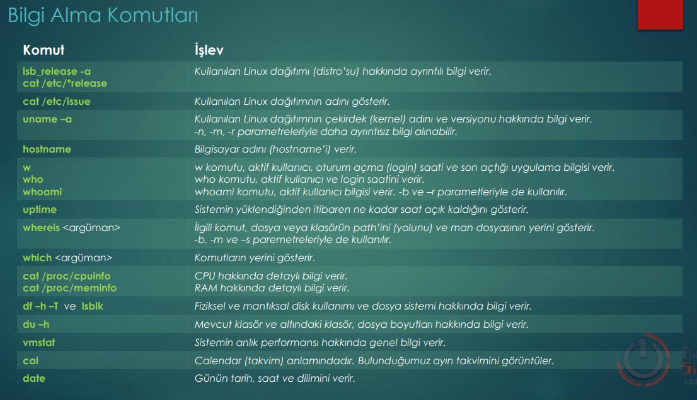
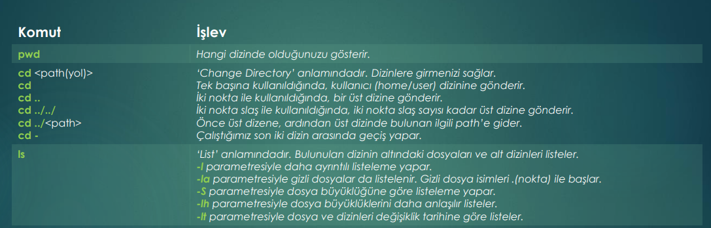
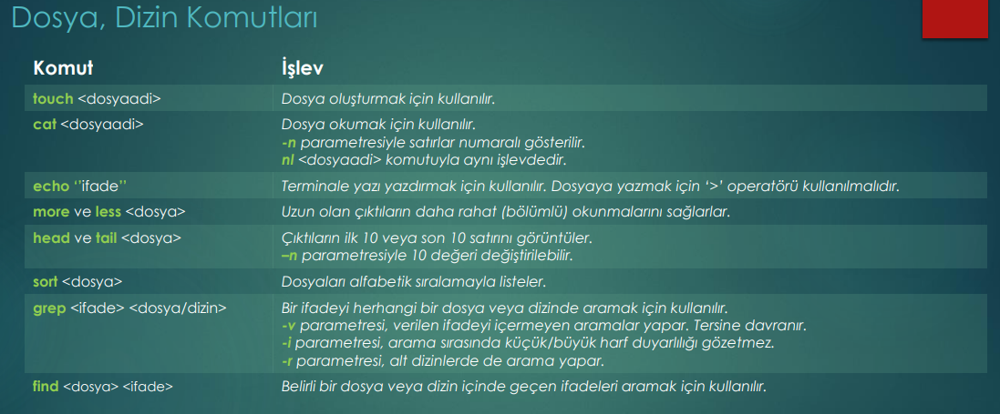
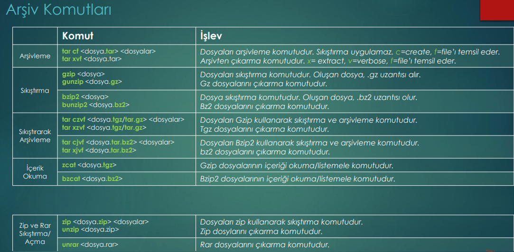
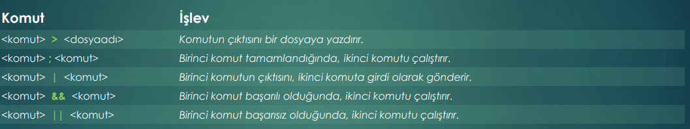
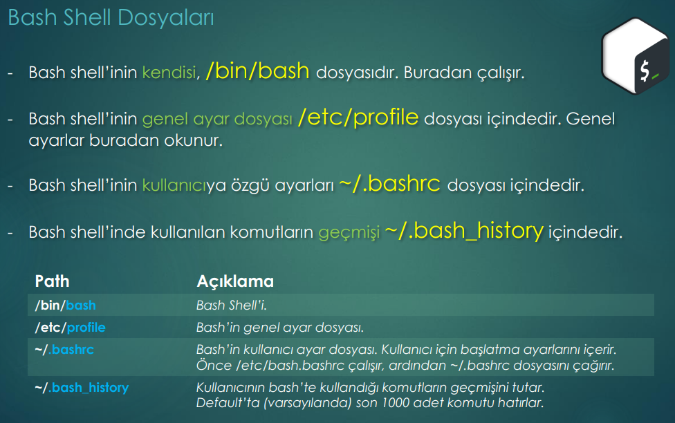

## Help Commands

If we use the ***whatis*** command with ***Wildcars*** we must use ***-w*** parameters. 
For more info from belgeler.org
## Info Commands

## Content Commands

## File_Directory Commands

## Archive Commands

## Command Operators

## Bash Tips

## info Commands

## info Commands

