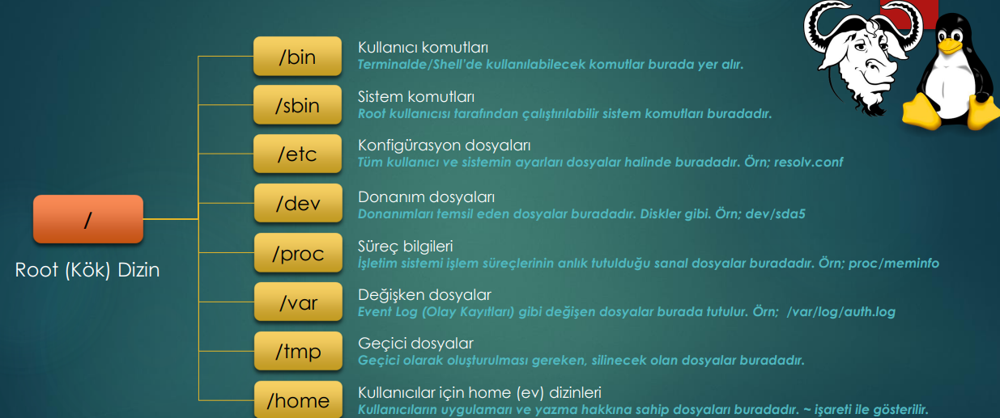
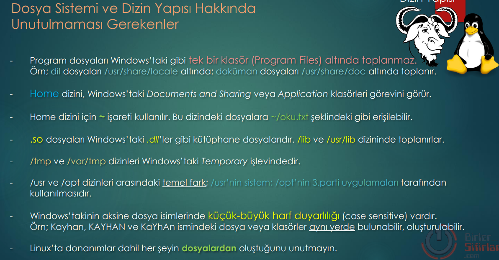

Linux means fiels; thats why we must know tis structure. 

| directory | usage |
| --------- | ----- |
| /     | root 
| /bin  | binaryes of commands for normal_user are here.  
| /sbin | binaries of commands for root_user are here. 
| /etc  | all system and user Configurations_Files are here. For example : resolv.conf for DNS configurations. 
| /dev  | Hardware_files; Example; sda5 5'th disk. 
| /proc | Prozess Infos are here: Example: /proc/meminfo ; /proc/cpuinfo
| /var  | Varisables, example: /var/log/auth.log
| /temp | Temporary files are here. For example any .rar file ist    firt in /temp directory opened and then in anotehr directory transferred. 
| /home | Applicationa of users , or files of users are here. ~ means home 

| /mnt  | Temporaryly mounted file_systems are here. 
| /opt  | The library_files of applikations, that have their own libraries are hier. Ex: /opt/winrar
| /srv  | Service_Files
| /usr  | Executable Files and Use applikations are here. 
| /lost+found | fter an unexpendet shutdown we can find the files
| /boot | The files for boot process are here.
| /lib  | System Libraries and Kernel_Modules are here.
| /media| Flash disk, USB , CD_ROM files are here. 

---

