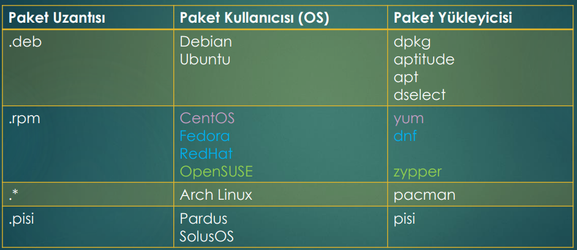

# Package Management Systems

There are two ways to install a program in Linux. 
+ to download the Source_Code and to compile the SourceCode
+ to use the Package_Manager

To install a progran, every Linux_Distor uses its own package manager. Actually there are also GUI-apps for that. Fow examüle snaptic .

Packet: Programs, that are already compiled and in a repo served for us to install. 

