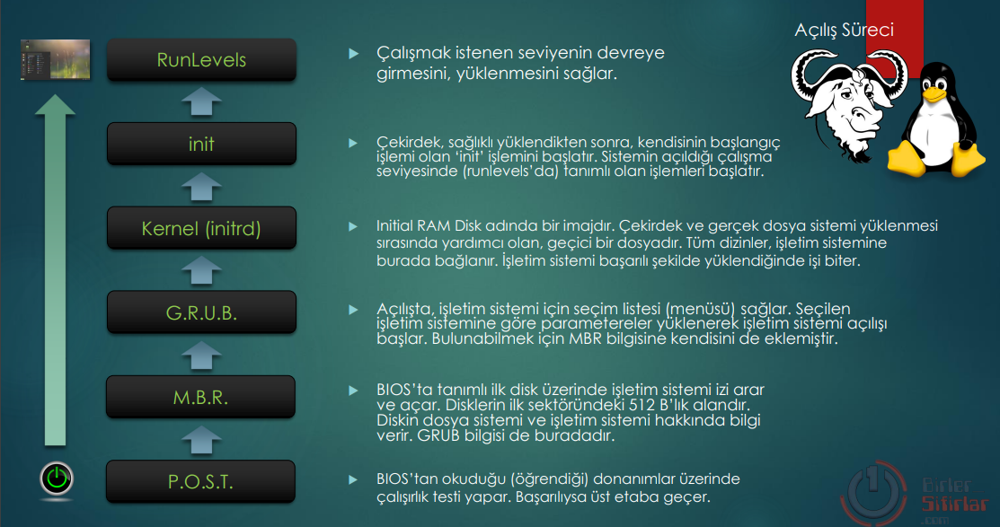
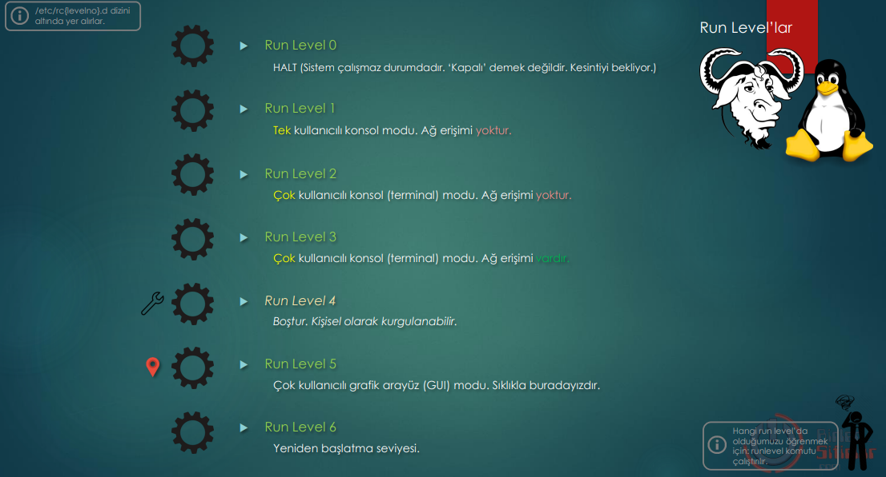

# RunLevels
Enables the level to be activated and loaded.

### Power On Self Test

as first step will be  the hardware testet, that is from BIOS read . 
when all hardware is functional goes to next step (MBR)

### MBR 
Any Opersaion System will be searcht , that is defined in BIOS defined. MBR is the first 512 B long Sector in the disk. MBR gives info for the File_System and Operating_System. GRUB_info is also heer kept. 

'''bash
// we will see the MBR sector
lsblk  // shows the disk and partitions info. ***sda*** is physical disk; sad1, sda2 are the logical partitions. 

sudo su -
fidsk -l   // this is the same as lsblk; But somteime befor running this commadn we must go into the /sbin folder. 

// lets read the first 512 B lang Part of ***sda*** and write the info in a file 
dd if=/dev/sda of=/home/otto/mbr_details bs=514 count=1

file mbr_details
// we get the response:" mbr_details: DOS/MBR boot sector"

### GRUB
In the Opening_Phase will be shown a Menü of possible OS. The Starting of OS beins based on some parameters, special for choosen OS. 

### Kernel (initrd) 
It is an image called initial RAMdisk. It is a temporary file that helps during the kernel and real file system loading. All directories are mounted here to the operating system. Its function ends when the operating system is successfully loaded.

### init
After installing the kernel properly, its initial process 'init' is started. It starts the process defined at the running level (runlevels) of the system.

