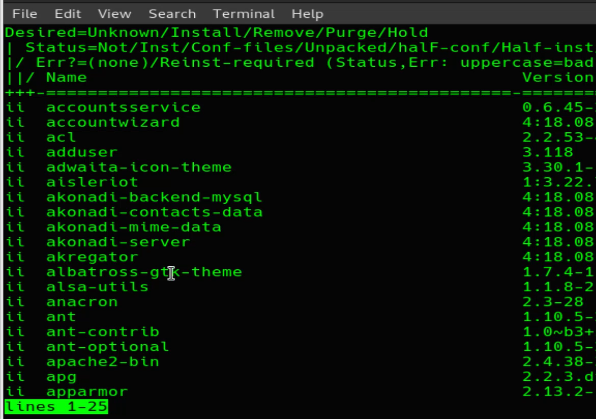

# MANUEL or from REPO INSTALLATION
Packages can be installed ***manuel*** or from  a ***repository*** . If we go with manuel-method, as firs we download the package (in our examle a package of files with ***.deb*** extensions) . 

- For manuel-method we use ***dpkg*** tool.
- For marepository-method we use ***apt*** tool.

if we use a redhat based OS for manuel installation use ***rpm*** tool; 
                            from repo installation use ***yum*** tool. 

## REPO_DIRECTORIES
We have selected a mirroring_url as we install the OS. The mirror adress will be set in for Debian ***/etc/apt/sources.list***/ or for CentOS ***/etc/yum.repos.d***/ .

# DPKG
***dpkg -l*** command *lists all packages* in the system .

***dpkg --get-selections*** command *lists all installed and uninstalled programs* in the system . It gives the list and info of  installation/uninstallatio-status. 

    //
    dpkg --get-selections

this command will gie us a long long list. To filter a specific program/packet we shoul/can grep the output. For examlpe let's control gedit-program. 

    //
    dpkg --get-selections | grep gedit

***dpkg -s <program_name.deb>*** command *gives us the info about the given program*. 

    // For example: let get info abaou gedit:
    dpkg -s gedit

***dpkg -L <program_name.deb>*** command *show the inhalt of the Package, where given program is*. 

***dpkg --info <packet_name.deb>*** command gives us the info of the packet, that is not yet installed, is just in repo. That why the extension of the packet is ***.deb*** . 

A package changes into a program after the installation. Thats why packets have an extension. We extract codes from packages and the codes will be then programs. 

bir paketi veya paket grubunu ("*.deb") install edebilmek icin ***sudo*** yetksin sahip olunmalidir. 

***dpkg -c <packet_name.deb>*** command gives us the info of the place, on where the packet will be installed. 

***dpkg -i <packet_name.deb>*** command installs the packet. With the usage of the  

We need to update && upgrade to avoid errors by Installaton. 

***"wildcard * "*** can multiple installation is also possible. 

***dpkg -reconfigure <program_name>*** command will repair the already installed program. 

***dpkg -P <program_name>*** command will prune the already installed program. 

"-P" or "--purge"

# APT

***apt-get install <program_name>*** command install the program from repo. 

    // Chromun miniversiyonu chromiumdur. 
    sudo apt-get install chromium

    // Bu program ile vmware in cozuburluk sorunu hallolur. Kopyala, yapistir, surukle-birak fonksiyonlarida aktif olur. 
    sudo apt install open-vm-tools

!!! To Open a program, just *write name of the program on console* && *Enter* .

***apt-cache show <program_name>*** command shows info about to be installed programs. 

***apt-get remove <program_name>*** command removes the already installed program . 

If we could reinstall the program, usin inly tthe remove cpmmand is sensible, because the configurations and dependencies would stay. But if we won'r install again purge command is the best. Because with that all config-files and dependencies will be erased. 

***apt-get purge <program_name>*** command removes the program with all its dependencies and configurations.

All reposa are under control, thats why installing fron repository is always more secure than manuel installation. 

see the repositorys

Heer we see the "http://ftp.tr.debian.org/debian/  adres as our main repository link-adress. These adress we have choosn as installing. 
We could have choosen any of global-repository but to avoid the week-latency we had choosen this repository, because it is locally nearer than others. 

