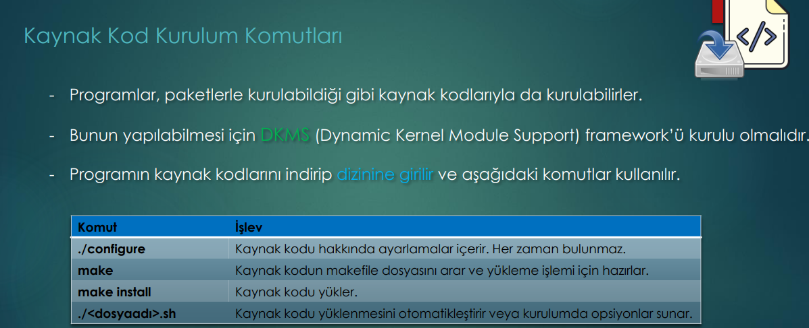

The codes to be installed can be in form of "source code". In such a case 

To install from source-code we need:
 - a framework ***DKMS (Dynamic Kernel Module Support)*** .
 - to download the source-code
 - to get in the same Directory of Source_Code. 
 - give these commands:
   + ./configure
   + make
   + make install
   # -/<fileName>.sh

