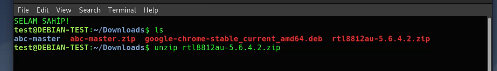
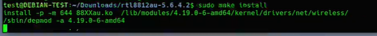

The codes to be installed can be in form of "source code". In such a case 

To install a program from it's source-code we need:
 - a framework ***DKMS (Dynamic Kernel Module Support)*** .
 - to download the source-code
 - to go in the same Directory of Source_Code. 
 - give these commands:
   + ./configure    
   + make                 
   + make install
   + ./< fileName>.sh

For example: We have a source code of realtech_chipset-driver. We got the source code from github. 

Note: as a  Practik: We can find many of the source codes in GitHub. 

1. Download the source code 

2. Go in the same Directory of Source_Code. 

As we see heer there is no ***./configure*** file in this source-code. Thats why we cant run it. 
But we see a ***dkms-install.sh*** and we must install this file. 
And to be able to install this source-code we must install framework :
    // 
    sudo apt install dkms

3. We are already in the same directory. 

4. run ***make*** command to use ***Makefile*** file in the source-code. This will prepare the installation. 

    // prepare for installation
    make

4. run ***make install*** command ***to INSTALL the Source-Code***. 

    // to install the source-code
    make install

5. NOT!!!: Eger ***.sh*** dosyasi var ise direk bu dosyalarin un edilmesi ile de installation halledilebilir. Bizim ornegimizde ***dkms-install.sh*** ve ***dkms-remove.sh*** adinda iki ayri ***.sh*** dosyasi var. 

    // direcktly to install the source-code
    ./dkms.install.sh