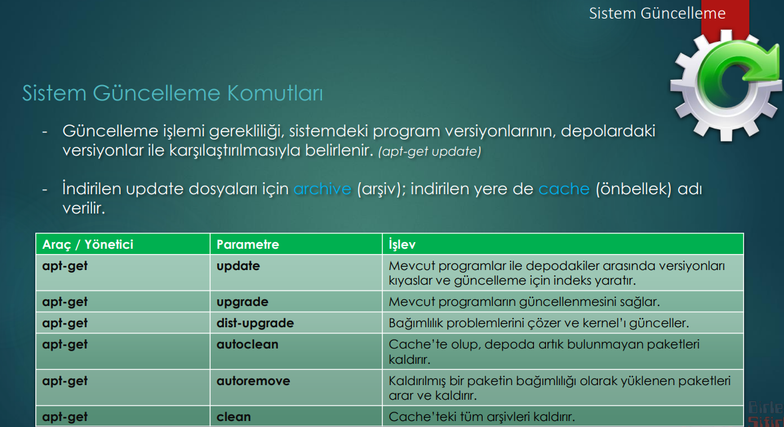

### Versiyon Karsilastirmasi

Güncelleme gerekliligi, sistemdeki program versioynu ile repository'deki versiyonarin karsilastirilmasi ile tespit olunur. Bu islemi apt-get update komutu yapar. Tespit edilen gereklilikler bir index dosyasina girilir.

    // to make an index_file
    apt-get update

Güncelleme islemi index_file a göre *apt-get upgrade* komutu ile hallolur. 

    // to upgrade
    apt-get upgrade

NOT: indirilen update dosyalarine ***archive***; indirilen yere ***cache*** denir. 

***sudo apt dist-upgrade*** komutu distribution u upgrade eder ama, kernel ' i yani cekirdegi de günceller. Ayrica begimlilik problemlerini de cözer. 

    // to upgrade
    apt-get dist-upgrade

Mesele update yaptik versiyon farklililarini hallettik. Aam bagimlilik iliskileri de degismis ise dist-upgrade yapilmalidir. 

***sudo apt autoremove*** komutu bagimilik iliskisi kalkmis ve ise yaramayan dosyalari arar ve kaldiri. 

    // to bagimlilgi kalmis paketzleri kaldirir
    apt-get autoremove

***sudo apt autoclean*** komutu artik repolardan kaldirilmis kalkmis ve ise yaramayan dosyalari arar ve kaldiri. 

    // to repolardan  kaldirilmis paketzleri kaldirir
    apt-get autoclean

***clean*** komutu herseyi siler, cok dikkatli olmak gerekir. Ancak yer konsuunda cok asiri ihtiyac var ise kullanilabilir. 