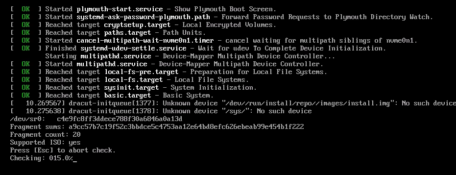

# FEDORA INSTALLATION

1. Download Fedora from: 
https://fedoraproject.org/server/download/

2. New VM
We can give .iso file later. Thats a better pratik. 
First we set the Maschine than install OS. 

3. Selecting Guest OS

4. Name the VM

5. Processor Configurations 

6. Memory for the VM. 
2048 is enough but 4096 better. 

7. Network type
Bridge Type, wenn needed we can cange in other types esasily. 

8. Select I/O Controller(SCSI_Controller for virtual disk)D Types
LSILogic is recoended. 

9. Select a Disk Type (What kind of disk?) 
MVMe is recommendend. 

10. Select a Disk Type (Which disk to use?)

11. Specify Disk Capacity. 

12. Specify disk name

13. Ready to go

14. Put .iso file in VM.

15. If possible use enhance keyboard. 

16. to enable choice for UEFI go advanced. 
UEFI or BIOS makes not much difference in side of server but lets try it. 

17. and Go. 

