# FEDORA INSTALLATION

1. it will read the .iso disk.
Its a better wayt to run test process before installation. Because its a server and better to be sure. 

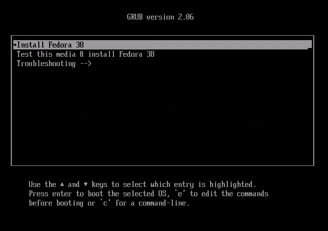
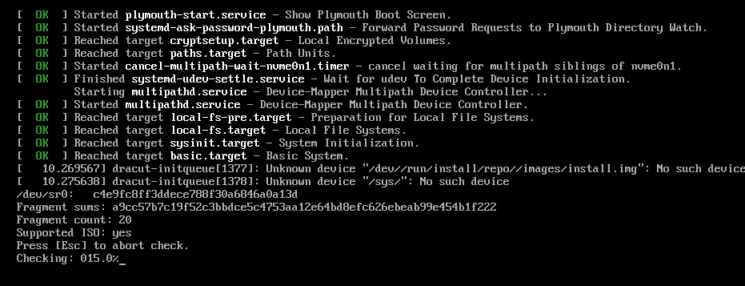

2. Then starts the instalation.

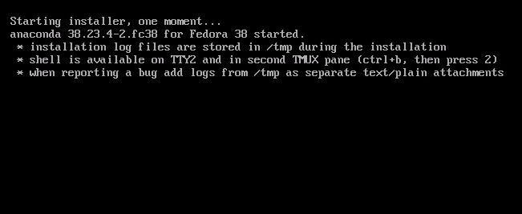

3. Language stettings

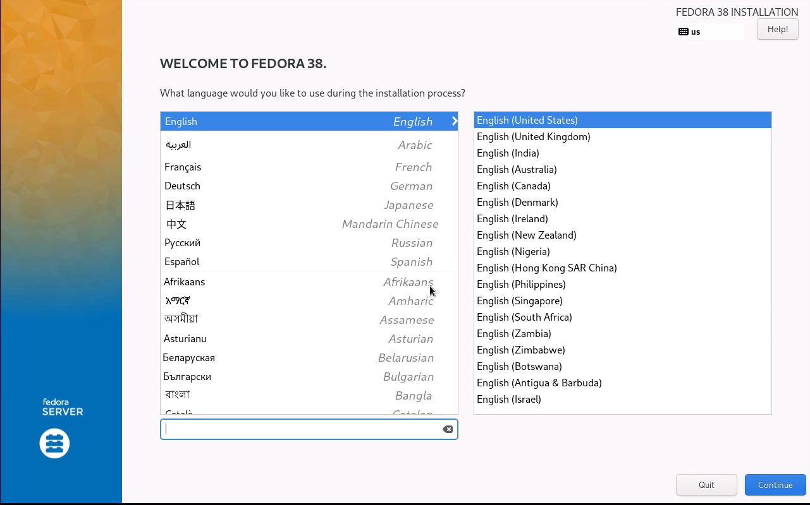

4. Keyboard, Time. Source, Software Destination and Network settings  Settings

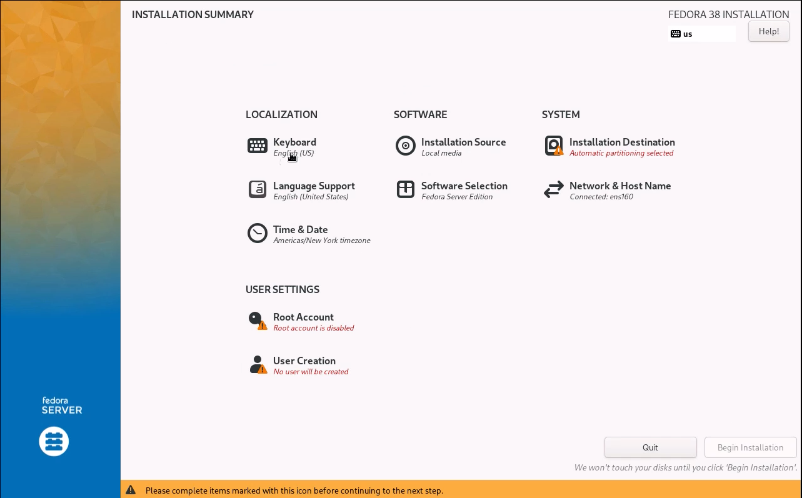

5. changing keyboard
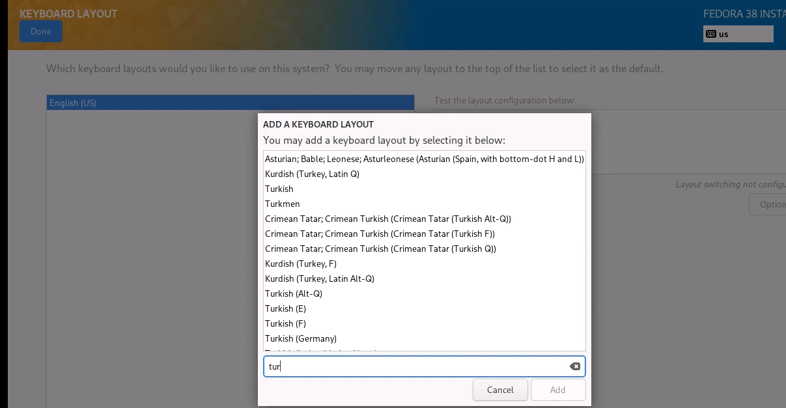

6. Time&Date
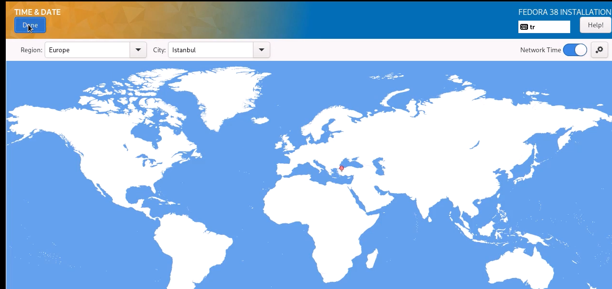

7. Installation Source
We go with our CD this time. It stay as "Device:sr0" under Auto-detected installation media:
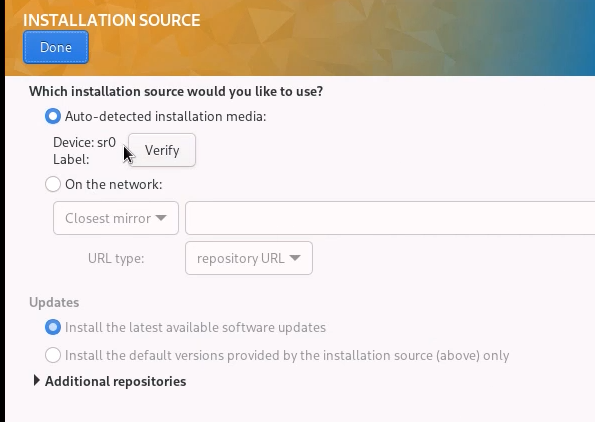

8. Software Selection
we can choose software to be installed with fedora. As Base Environment "Fedora custom .." bring more choice. As "Additional Software for Selected Environment" We can choose nearly all of them.  

For example: Soweit we install over a Hypervisor, we should install "Guest Agents". 
We like "common Network management subtools". "Standard" utilities expands the minimal tools. 
"Headless management" makes possible to manages the server with ssh-connection.Headless managenet resembles the remote control. 
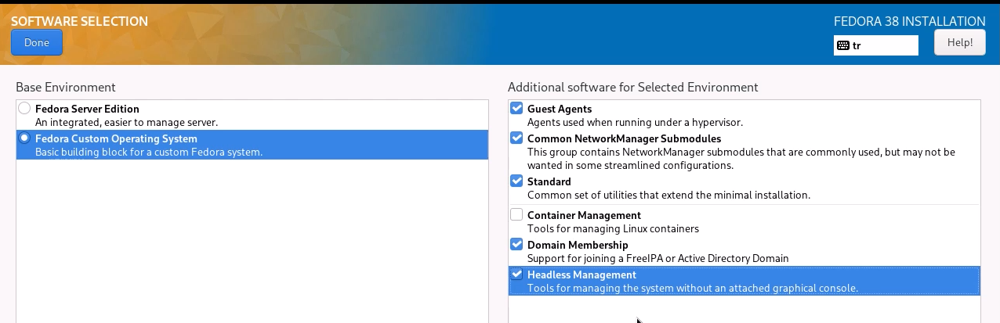

9. Installation destination: 
We can select the destination from a range or we can choose a RAID System. 
Or we can also add a disk. 
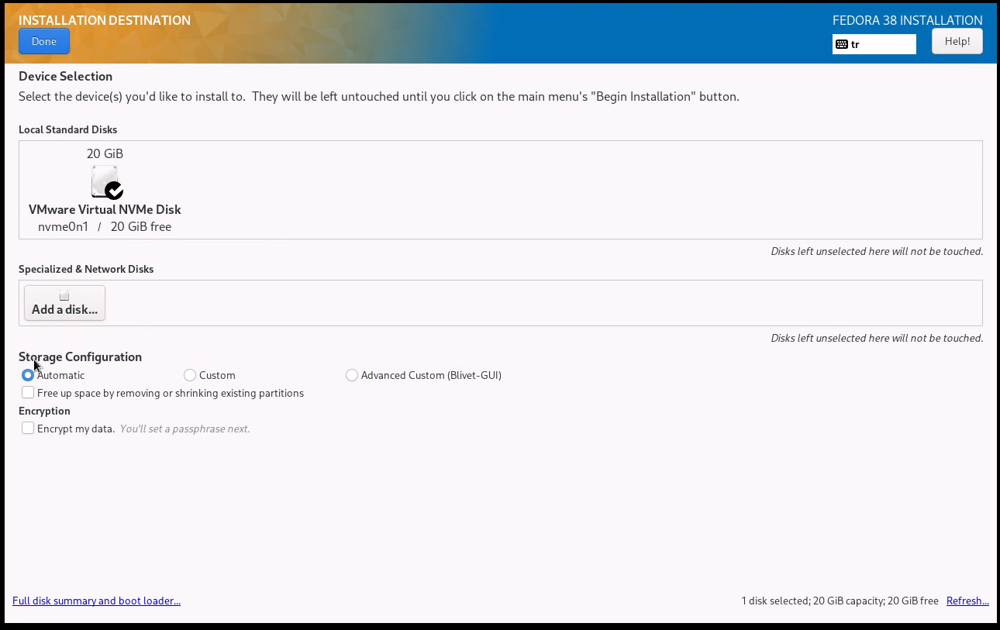

For storage configuration we go with "Advanced Custom" .We structure the disk-table with partitioning. 

In Servers ***LVM can not manage Boot-Partitions***. 
Bott-infos must be in a standart Partition type. The type will be cahenged in accordance with Mainborad Mode:
    if BIOS-Mode boot must be on an MBR -type Partition 
    if UEFI-Mode boot must be on an GPT -type Partition 
    
But in client side LVM can manage boot partititon, because it installs LVM vurtually. 

### ext4 vs xfs

ext4 : debian-based,  faster,   can manage max 16 TB file,  partition can max 1 xbyte,  journaling can be disabled.

xfs  : redhat-based,  groser files, can manage max 8 XB file, partition can max 8 xbyte, journaling can NOT be disabled.

## !!! Bott Partition must be always at first in partition-table. Otherwiese we can not expant the disk. 

#### Boot-partition:
Size: 0.6 GIB
FileSystem: EFI System partition
Label: (if we want, can be given) EX: "bootpartition"
Mount Point: ***/boot/efi***

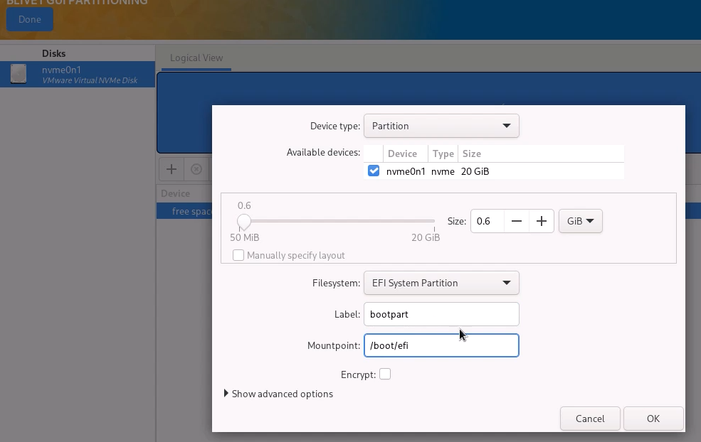

#### Root-PArtition
Size: 17 GIB
FileSystem: ***xfs*** System partition
Label: (if we want, can be given) EX: "root-partition"
Mount Point: ***/***

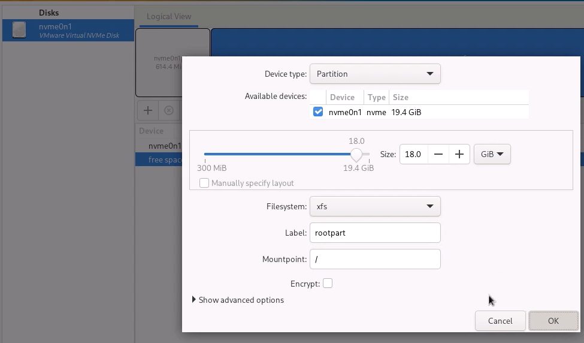

#### swap -PArtition
FileSystem: ***swap*** System partition
Label: (if we want, can be given) EX: "swap-partition"

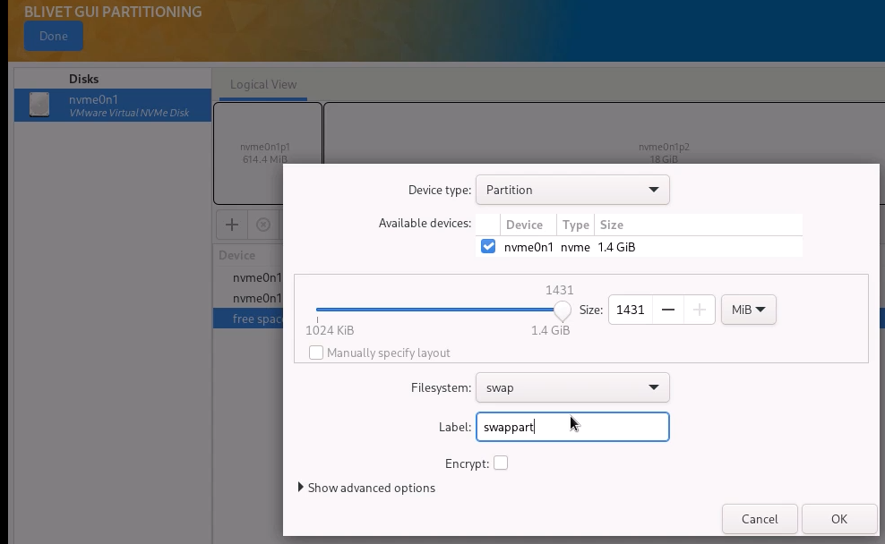

We see the partititon Table

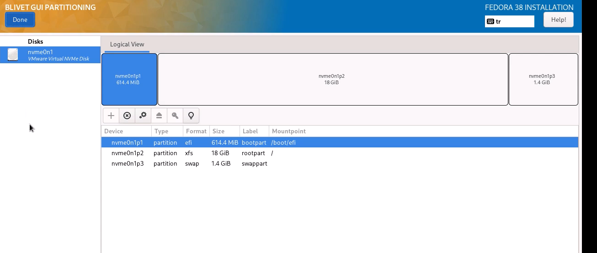

## LVM PArtition
Lets use LVM
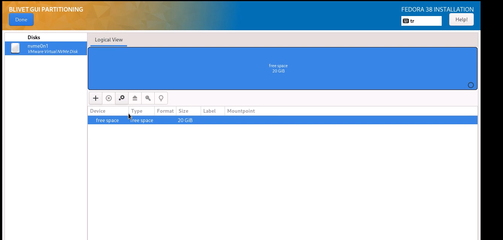

if we want to use the partititon fora Dtatabase we can use LVM. 
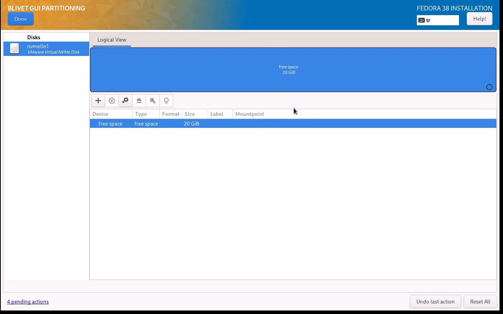

in this chooice LVM Partition would be logically seperated as another disk. 
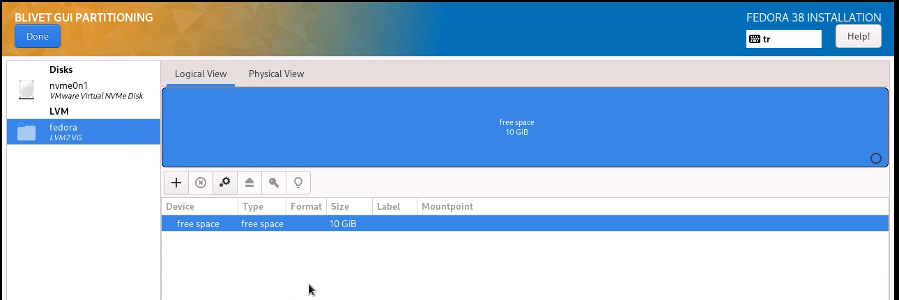

# Network Host Name

We can see the IP s came from DHCP. or we can manually and statically. configure them. 

 Its importatnt to have in this section a netork connection to download the packages. 

 # ROOT account:

We should open a root account. 

***For root-account ssh is not recommenden***. But if we want we open later. 

# USER account

We can specify advanced group and home configurations here. 

