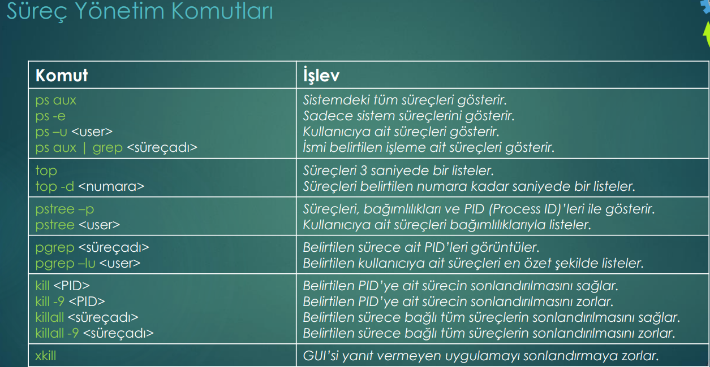

Process mean a running progran for that resources an privilages dedicated. 

to see all processes command ***" ps aux "***.
to see system processes command ***" ps -e "***.
to see user processes command ***" ps -u "***.
to see filtered processes command ***" ps aux | grep <nameofProcess> "***.

command ***"pstree "*** can be used without any parameter; but with parameter  ***" -p "*** we can see also the processID's. 

For process_monitoring there is a GUI alternative:

command: ***"systemmonitor"***
for mate command: ***"mate-system-monitor"***