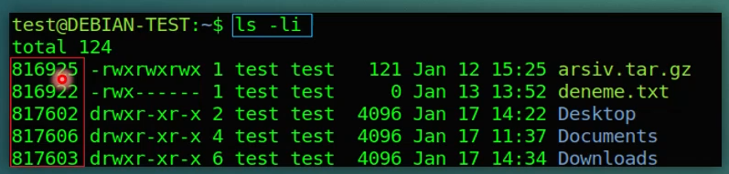
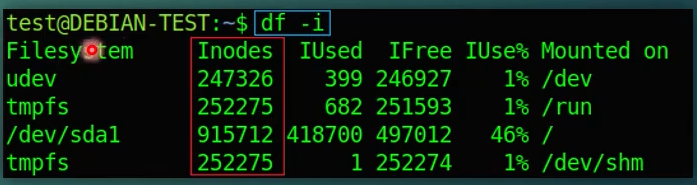
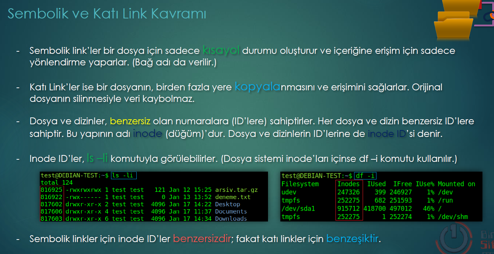
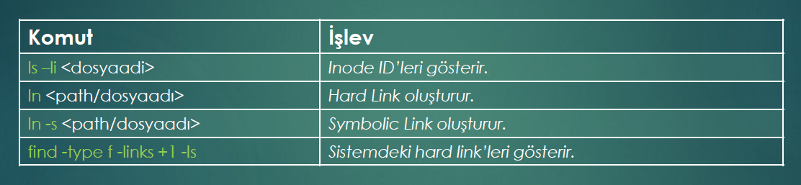
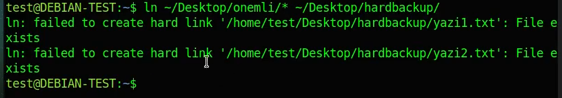

Symbolic link is also called soft-link. 

Symbolik links are shortcus for a file. 

Hard-links are the actual copy of a file. Althougt the original file is eraed we aould have the actual copy of this file. 

Any file or folder have unique ID's called Inode_ID.

**The InodID's of Symbolink are UNIQ.**

**But the InodID of HarLinks are SAME with original.**

We can see inodeId's of files with command " ls -li " .

The InodID s for a file system use command " df -i " .

The command " find -type f -links +1 ls " is important ; because the file manager can not distinguishes the hardlinks. Even if the name of the files are different, this command shows the hardlinks. Because harlink is related to the content; not the name.

Note that: Even if the filenames of hardlinks are different from original, the ids will be the same. Because InodID is based on content. 
Even if we delete the orginal, hsrdlink will survive. 

!!! To copy all content a folder use " * " wildcard. It s a good practic to get BackUp. 

Soft-link automatically stays in sync with the original. Softlink directs not the initial version, but the last-actual version of file. 

